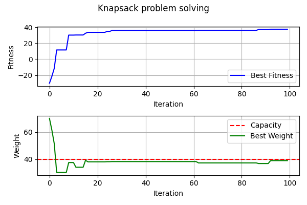

# Knapsack Problem Example with Artificial Bee Colony (ABC) Algorithm

This example demonstrates how to solve the classic **0/1 Knapsack Problem** using the Artificial Bee Colony (ABC) optimization algorithm implemented in this repository.

## Problem Description
The knapsack problem is a combinatorial optimization problem where you are given:
- A set of items, each with a weight and a value.
- A knapsack with a maximum weight capacity.

The goal is to select a subset of items to maximize the total value without exceeding the knapsack's weight capacity.

## Approach
We use the **Artificial Bee Colony (ABC)** algorithm, a nature-inspired metaheuristic based on the foraging behavior of honey bees, to search for the optimal or near-optimal solution.

- Each bee represents a candidate solution (a selection of items).
- The algorithm iteratively improves solutions by simulating employed, onlooker, and scout bee behaviors.
- The fitness function rewards solutions with high value and penalizes those exceeding the weight capacity.

## How to Run
1. Make sure you have the required dependencies:
   - `numpy`
   - `matplotlib` (for plotting, optional but recommended)
2. Run the example script:
   ```bash
   python knapsack.py
   ```
3. The script will print the progress of the optimization and display a plot of the best fitness and weight over iterations.

## Resulting Plot
Below is an example of the output plot generated by the script:



- The **top plot** shows the best fitness (total value) found at each iteration.
- The **bottom plot** shows the weight of the best solution, with the red dashed line indicating the knapsack's capacity.

## Customization
- You can change the number of items, bees, or iterations by modifying the parameters at the top of `knapsack.py`.
- The fitness function can be adapted for other combinatorial or continuous optimization problems.

---
For more details, see the code and comments in [`knapsack.py`](knapsack.py).
